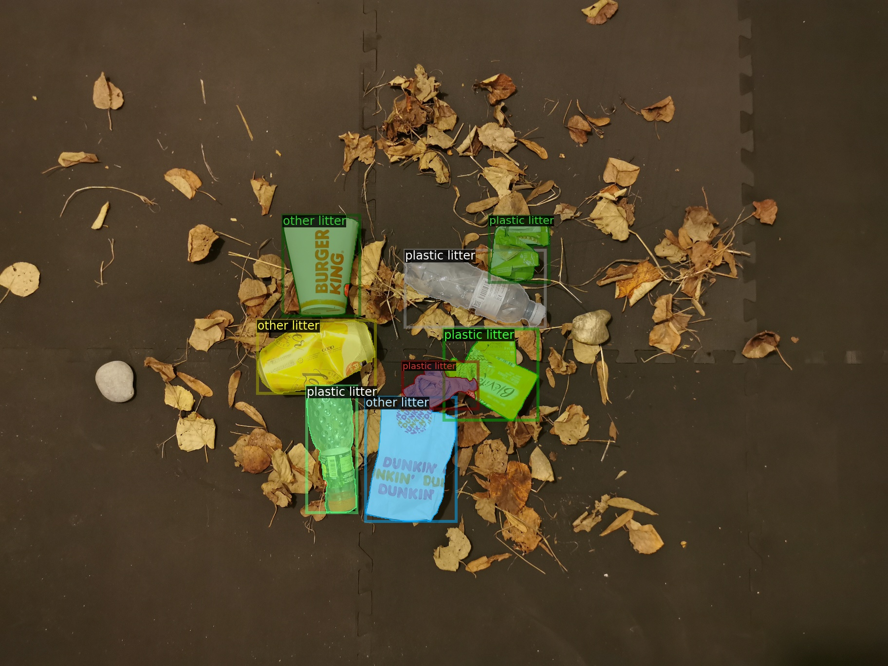
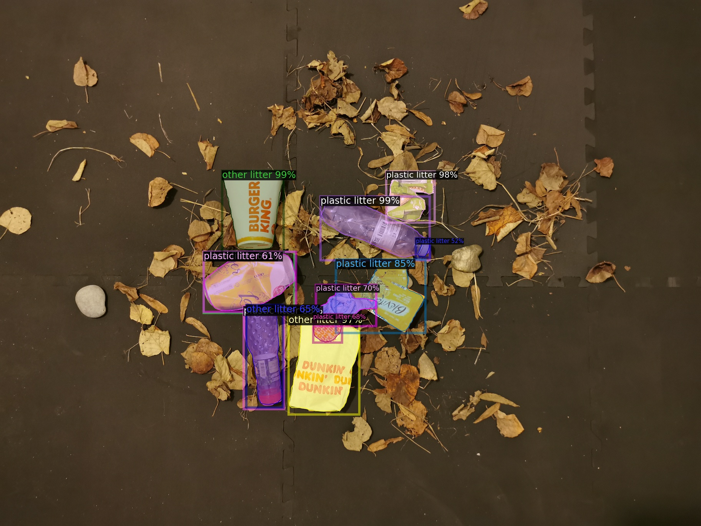

## ARCNET - Autonomous Trash Detection

The arcnet is a custom network developed to automatically detect riverine waste. 
It builds upon the Detectron2 developed by Facebook research. Some of the code is 
adapted from P. Proenza's [TACO](https://github.com/pedropro/TACO) repository, 
for data visualization and download.  

#### Dependencies
This implementation used the following packages and versions. 
    
    - CUDA: 11.0
    - Nvidia Driver 450.80.02
    - Pytorch 1.7.0
    - Python 3.8.5
    - Ubuntu 18.04.5 LTS
    - Nvidia GeForce GTX 1070
    
Detectron2 system can be installed directly from [here](https://github.com/facebookresearch/detectron2/blob/master/INSTALL.md). 

The model was custom trained using the [TACO](http://tacodataset.org/) dataset,
 and the classes were remapped to two litter detection cases.
 
    Case 1:
    - "name": other litter, "id": 1 
    - "name": plastic litter, "id": 2
    
    Case 2: 
    - "name": litter, "id": 1 

##### Notes on implementation. 

This implementation adapts code written by TACO's developer, P. Proenza, 
to split and remap the plastic debris dataset. Additional remapping was implemented to 
annotate the trash debris based on the desired use case. In addition, duplicate annotations were
also removed. Detectron2 models were tested, and the best performing was selected. A test dataset
containing litter items collected in Zurich were used for performance testing. More information about 
each file is found in their respective comments, or description. 

#### File Breakdown 
The following files and directories are included, with a brief description on each of them. 
- Python Files (model, training, and testing)
    - `arcnet_main.py` model training, testing, and validation file. 
    - `CocoTrainer.py` detectron2 custom trainer with COCO evaluation hooks
    - `detectron_test.py` run to verify detectron2 is installed properly and working with TACO dataset
    - `LossEvalHook.py` custom hook added to detectron2 to calculated validation loss during training (which is not standard functionality)
    - `MyTrainer.py` custom trainer file to include validation loss
    - `predictor_demo.py` standard Detectron2 file for performance testing and visualization
    - 
- Python Files (visualization and plotting)
    - `plot_metrics.py` plot performance metrics from a `metrics.json` file after training, variable input
    - `plot_results.py` plot performance metrics from a `metrics.json` file after training, fixed input
    - `PlotTogether.py` plot performance metrics from a `metrics.json` file after training, fixed input, displays multiple figures in the same window
    - `dataset_vis.py` dataset visualization tools using detectron2 model and custom dataset 
    
- Python Files (dataset handling)
    - `download.py` download file for TACO images used for training
    - `remap_classes.py` reads annotaions (`.json` files) and class remap (`.csv` file) and outputs new annotation files
    - `split_dataset.py` takes an annotations file (`.json`) and splits it into training, testing, validation datasets for x 
    many equivalent sets for cross validation. 
    - `utils.py` file containing useful functions for dataset annotation, and image resizing. 
    - `test_dataset/export_segments.py` converting dataset file created by 'segments.ai' into coco format for training.
    
- Jupter Notebooks (no dependencies linked to solution):
    - `Class Remap Notebook.ipynb` implementation of class remapping for TACO dataset. 
    - `dataframes for cross validation.ipynb` cross validation training and metrics plotting
    - `demo_arcnet_vis.ipynb` demo notebook for dataset visualization with remapped classes for ARCNET

Directories:
- coco_eval: output files for coco evaluation metrics. 
- data: directory containing TACO dataset (in batches) and all annotation files. 
- figures: varied performance figures. 
- img_out: output directory for predictions
- img_test: location for all images used for qualitative evaluation of model prediction performance. 
- kfold_results: output directory of cross validation metrics for both prediction cases.  
- maps: class remapping cvs files. format is: old_class,new_class
- old logs: `tfevents` files for old training and evaluation results. 
- output: directory containing all output files from training, at different hyperparameters. Divided into 1 class detection, and 
2 class detection. Best model for each (as determined by the gridsearch) are named `final1class.pth` and `final2class.pth`
- segments: directory containing "arc-litter" dataset used to test model performance. Can be downloaded directly by running 
`export_segments.py`
- test_dataset: directory containing "arc-litter" dataset annotation files. 
- video_test: video files to test performance of
- video_out: model output predictions for the video files
----
### Procedure for replication:
#### Setup:
1. Clone this repository to your local machine

   `git clone https://github.com/phideltaee/arcnet.git`

2. Download the TACO dataset data by calling:

    `python download.py`
    This will create a folder called "data" which will include the TACO images in subdirectories named "batch_1" through 15.  

3. Create a custom dataset by remapping classes to desired map us the remap_classes.py script. 
The input arguments are the relative path to the map file desired, and the relative path to the annotations file. For remapping to "litter" use "maps/map_1.csv", for remapping
to "other litter" and "plastic litter", use "maps/map_to_2.csv" when running from the root directory. Example mapping to 2 classes:

    `python remap_classes.py --class_map maps/map_to_2.csv --ann_dir ./data/annotations.json`

4. Split dataset into train-test splits, k-times for k-fold cross validation.
    
    Example: `python split_dataset.py --nr_trials <K_folds> --out_name <name of file> --dataset_dir <path_to_data>`
    
    Example: `python split_dataset.py --nr_trials 5 --out_name ann_05  --dataset_dir data`
    
    The annotation files will be saved to the data folder with the given naming convention. 

5. Download the ARC-litter dataset. 

    Download directly from the Segments.ai, https://segments.ai/festay/arc_litter/
    
    OR
    
    run the download script: `python test_dataset/export_segments.py`

    Two versions of the Arc-litter-v2.1 dataset used for testing results for this implementation are already included 
    in the "test_dataset" folder, under arc_litter-v2.1_coco1.json (1 class) and arc_litter-v2.1coco2.json (2 classes).

#### Training

1. Train Mask R-CNN Model

    This is done by running the `arc_main.py` file with the `train` command. You must specify which dataset is to be used,
    number of classes. 
    
    Example: `python arcnet_main.py train --class_num 2 --ann_train 
    ann_0_map1train.json --ann_val ann_0_map1val.json
`
    
    The arguments are the following:
   
    
    
        parser.add_argument('--class_num', required=True, type=int, metavar="Number of classes", help='Number of target classes')
        parser.add_argument('--image_path', required=False, default='./img_test/test_img1.jpg',  metavar="/path/file.jpg", help='Test image path')
        parser.add_argument('--data_dir', required=False, default='./data', metavar="/path_to_data/", help='Dataset directory')
        parser.add_argument("command", metavar="<command>",help="Opt: 'train', 'test', 'inference")
        parser.add_argument('--weights', required=False, default='./output/taco_500_arc.pth', metavar="/trained_weights.pth", help='weights used for inference')
        parser.add_argument('--ann_train', required=False, metavar="file.json", help='Train Data Annotations')
        parser.add_argument('--ann_test', required=False, metavar="file.json", help='Test Data Annotations')
        parser.add_argument('--ann_val', required=False, metavar="file.json", help='Validation Data Annotations')

#### Testing 
To test a trained model (saved as a `model.pth` file), run the `arc_main.py` with the command "test", "inference" or "infer_mask". 

1. Test provides an evaluation in "COCO" style of the model performance, calculating AP, precision and recall at several 
intersection over union.

    Example: ``
 
2. Inference, makes a prediction on a given image. 

    Example: `python arcnet_main.py inference --weights 
    output/final2class.pth --image_path img_test/rs_conv1080.jpg --class_num 2 
    --ann_train ann_0_map2train.json --ann_val ann_0_map2val.json`

3. Infer_mask, makes a prediction of a given image, and it outputs both the 
prediction, and the ground truth mask for visualization.

    Example: `python arcnet_main.py infer_mask 
    --weights output/final2class.pth --class_num 2 --image_path 
    img_test/conv_1080p.jpg 
    --ann_train ann_0_map2train.json 
    --ann_val ann_0_map2val.json`

#### Replication of Results (Cross Validation and Performance)
To replicate results, run the `arc_main.py` script with the command "train_crossval" which will 
perform the 5-fold cross validation evaluation of the results presented in this project. 

### Results 
##### Initial results for testing:
First testing: (poor results)

    - LR: 0.000125
    - Iterations: 300
    - Workers: 2

Second testing: (better results)

    - LR: 0.0025
    - Iterations: 2000
    - Workers: 2
    - img per batch: 2
    - ROI Heads batch size per image: 264
    
#### Optimal Results

Setup:

    - LR: 0.0025
    - FREEZE: 2
    - Iterations: 2000
    - Workers: 2
    - img per batch: 2
    - ROI Heads batch size per image: 264
Final Results:
    
    Litter Detection:
    - AP bbox: 51.17
    - AP@.5 bbox: 72.69
    - mAP segm: 51.75
    - Mask R-CNN accy (%): 92.9
   
    Plastic/Other Detection:
    - AP bbox: 32.84
    - AP@.5 bbox: 47.9
    - mAP segm: 33.96
    - Mask R-CNN accy (%): 93
    

see more at [ARC Project](arc.ethz.ch)